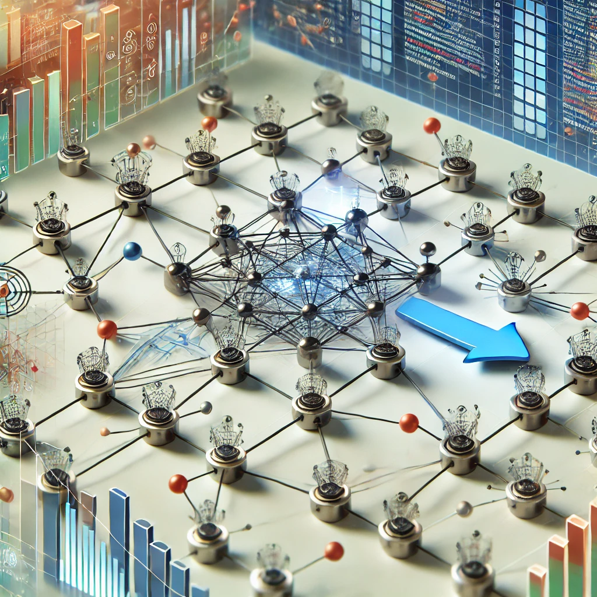

<h1 align="center"> 
  Awesome Multi-Agent Reinforcement Learning (MARL) 
   on Graphs 
 </h1>

  
  
  
  
  

A curated collection of resources, implementations, research papers, and tools focused on **Multi-Agent Reinforcement Learning (MARL)** in the context of **Graph-based** environments. This repository aims to provide a comprehensive overview of the intersection between MARL and graph theory, enabling researchers and developers to explore, understand, and build on the emerging applications of multi-agent systems in graph-structured domains.

## Table of Contents

- [Graph-Based Machine Learning](#-graph-based-machine-learning)
  - [Papers](#papers)
  - [Books](#books)
  - [Talks](#talks)
- [Game Theory for Machine Learning](#game-theory-for-machine-learning)
  - [GANs](#gans)
  - [Other Resources](#other-resources)
- [Multi-Agent Reinforcement Learning](#multi-agent-reinforcement-learning)
  - [Papers](#papers)
  - [Talks](#talks)
  - [Books](#books)
  - [Blogs](#blogs)
  - [Miscellaneous](#miscellaneous)

## What is MARL on Graphs?

Multi-Agent Reinforcement Learning (MARL) involves multiple agents interacting within an environment, with the goal of learning optimal policies through trial and error. In graph-based environments, these agents are typically represented as nodes in a graph, with edges defining relationships or interactions between agents. This setup allows for a diverse range of applications, from social network analysis to decentralized decision-making in robotics and smart grids.

## Who is this for?

- Researchers and practitioners interested in **multi-agent systems** and **reinforcement learning**.
- Developers looking for resources to **implement MARL algorithms** in graph-based environments.
- Students seeking a comprehensive introduction to the **intersection of MARL and graph theory**.

---

## Graph-Based Machine Learning

Graph-based machine learning focuses on applying machine learning techniques to graph-structured data.

### Papers
- [Title of Paper 1](#)
- [Title of Paper 2](#)

### Books
- *Graph Machine Learning Book 1* - A deep dive into learning from graph data.

### Talks
- [Talk on Graph-based Machine Learning](#)

---

## Game Theory for Machine Learning

Game theory plays a significant role in understanding competitive and cooperative behaviors in multi-agent systems, including GANs.

### GANs
- [Introduction to GANs in Multi-Agent Settings](#)

### Other Resources
- [Game Theory and its Application to Machine Learning](#)

---

## Multi-Agent Reinforcement Learning

Multi-Agent Reinforcement Learning (MARL) involves multiple agents interacting in an environment, learning to maximize their respective rewards through coordinated actions.

### Papers
- [Paper on MARL Algorithm 1](#)
- [Paper on MARL Algorithm 2](#)

### Talks
- [Talk on MARL in Graph Environments](#)

### Books
- *Multi-Agent Reinforcement Learning* - A comprehensive guide to MARL systems.

### Blogs
- [Understanding MARL in Complex Environments](#)

### Miscellaneous
Other resources and content related to MARL.

## Contribute

Contributions are very welcome. Please use Github issues and pull requests.

### List of Contributors

Thanks for all your contributions and keeping this project up-to-date.

## License

[LICENSE](LICENSE)

Creative Commons

(C) 2021-2024
